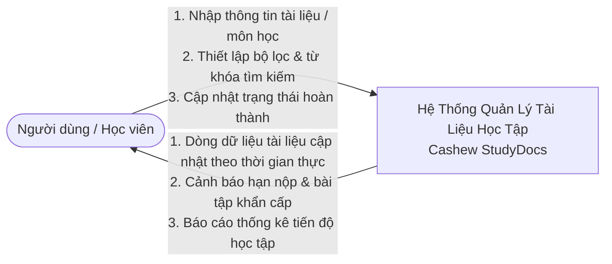
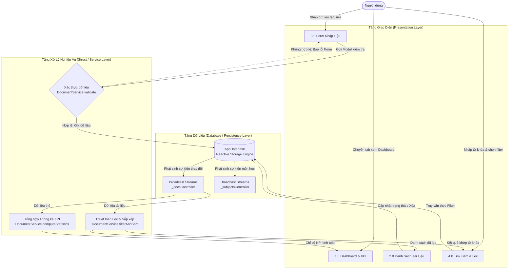
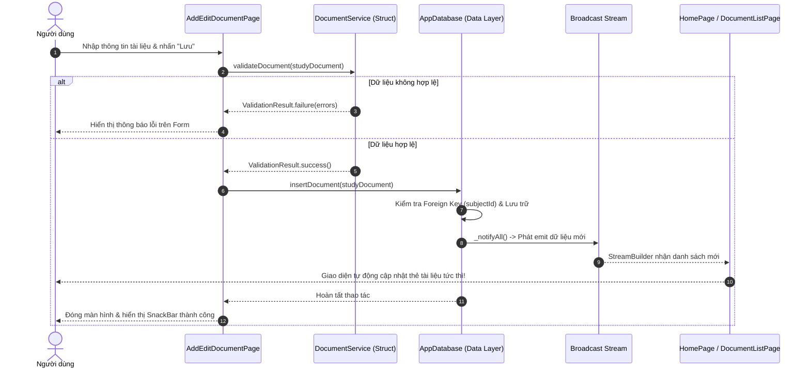
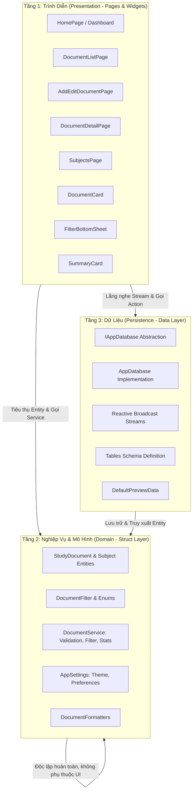

# BÁO CÁO THIẾT KẾ VÀ TRIỂN KHAI HỆ THỐNG
## ỨNG DỤNG QUẢN LÝ TÀI LIỆU HỌC TẬP (CASHEW STUDYDOCS)
### Áp dụng Nguyên lý Kiến trúc Phân tầng & Reactive Streams của Dự án Cashew

---

## 1. Phân Tích Yêu Cầu Chức Năng & Luồng Dữ Liệu

### 1.1. Yêu cầu chức năng (Functional Requirements)
Ứng dụng được thiết kế nhằm phục vụ sinh viên, giảng viên và người tự học quản lý toàn diện các tài nguyên học tập với 4 nhóm tài liệu chính:
* **Bài giảng (Lectures / Slides):** Lưu trữ tài liệu học tập lý thuyết, ghi chú theo chương, liên kết tải slide PDF/PPTX.
* **Bài tập & Đồ án (Assignments / Projects):** Quản lý bài tập về nhà, bài tập lớn, theo dõi hạn nộp (Deadline), trạng thái xử lý (*Chưa làm*, *Đang làm*, *Đã hoàn thành*) và cảnh báo quá hạn.
* **Tài liệu tham khảo (References):** Sách giáo trình, bài báo nghiên cứu, tài liệu hướng dẫn kỹ thuật, liên kết ngoài.
* **Đề cương & Đề thi (Exams / Reviews):** Đề cương ôn tập giữa kỳ/cuối kỳ, ngân hàng câu hỏi, đề thi mẫu.

**Các chức năng cốt lõi:**
1. **Quản lý Tài liệu (Documents CRUD):**
   * **Thêm mới (Create):** Xác thực dữ liệu đầu vào (tiêu đề, môn học, loại tài liệu, mức độ ưu tiên, hạn nộp, tệp đính kèm/URL, tags phân loại).
   * **Cập nhật (Update):** Chỉnh sửa thông tin, thay đổi trạng thái hoàn thành nhanh, cập nhật thời gian sửa đổi gần nhất.
   * **Xóa (Delete):** Hỗ trợ xóa tài liệu với cơ chế xác nhận và nút Hoàn tác (Undo SnackBar).
   * **Đánh dấu Yêu thích (Favorite / Pin):** Ghim các tài liệu quan trọng lên đầu.
2. **Quản lý Môn học (Subjects / Courses Management):**
   * Quản lý danh mục học phần: Mã môn học, Tên môn, Giảng viên, Màu nhận diện Material 3, Số tín chỉ.
   * Ràng buộc toàn vẹn dữ liệu (Cascade Delete): Khi xóa môn học, hệ thống tự động xử lý/thu hồi các tài liệu thuộc môn học đó.
3. **Tìm kiếm & Bộ lọc Đa tiêu chí (Search & Multi-criteria Filtering):**
   * **Tìm kiếm thời gian thực (Live Search):** Khớp từ khóa trên tiêu đề, mô tả tóm tắt, tên môn học và thẻ `#tags`.
   * **Bộ lọc trượt Cashew Filter Sheet:** Kết hợp lọc đồng thời theo Loại tài liệu, Môn học, Trạng thái, Mức độ ưu tiên, Hạn nộp và Đánh dấu sao.
   * **Sắp xếp linh hoạt (Multi-criteria Sorting):** Theo ngày tạo mới nhất/cũ nhất, hạn nộp gần nhất, tên A-Z, hoặc mức độ ưu tiên cao nhất.
4. **Dashboard Thống kê & Theo dõi Tiến độ (Study KPI & Metrics):**
   * Biểu đồ tiến độ hoàn thành bài tập tổng thể.
   * Thẻ chỉ số nhanh: Tổng số tài liệu, Bài tập cần nộp, Nhiệm vụ khẩn cấp, Cảnh báo quá hạn.

---

### 1.2. Sơ đồ Luồng Dữ liệu (Data Flow Diagrams - DFD)

#### Sơ đồ DFD Mức 0 (Context Diagram)
Mô tả sự tương tác giữa Người dùng (Sinh viên/Học viên) với toàn bộ hệ thống ứng dụng:



#### Sơ đồ DFD Mức 1 (Detailed Data Flow Diagram)
Mô tả dòng luồng dữ liệu chi tiết giữa các tiến trình xử lý, kho lưu trữ và các tầng logic:



#### Sơ đồ Tuần tự (Sequence Diagram): Thao tác Thêm Tài Liệu Mới & Phản ứng Tức thì



---

## 2. Thiết Lập Cấu Trúc Thư Mục Chuẩn Kiến Trúc Cashew

Cấu trúc dự án được tổ chức chính xác theo mô hình 4 phân tầng nổi tiếng của ứng dụng nguồn mở **Cashew** (`f:\Flutter\Cashew\budget`), mang lại tính mô-đun hóa tối đa, khả năng mở rộng không giới hạn và dễ dàng kiểm thử độc lập:

```text
study_document_manager/
├── lib/
│   ├── colors.dart                       # Hệ thống màu Material 3, Dark/Light Palette chuẩn Cashew
│   ├── main.dart                         # Điểm khởi tạo ứng dụng, DI Provider & Database instance
│   │
│   ├── database/                         # TẦNG 1: PERSISTENCE & DATA ACCESS LAYER
│   │   ├── tables.dart                   # Định nghĩa cấu trúc Schema các bảng (SubjectsTable, DocumentsTable)
│   │   ├── app_database.dart             # Database Engine, Reactive Streams (watch...), CRUD & Cascade Delete
│   │   ├── database_global.dart          # Biến toàn cục database theo pattern chuẩn của Cashew
│   │   └── default_preview_data.dart     # Bộ dữ liệu mẫu khởi tạo (tương đương generatePreviewData của Cashew)
│   │
│   ├── struct/                           # TẦNG 2: DOMAIN MODELS & BUSINESS LOGIC LAYER
│   │   ├── models.dart                   # Enums (Type, Status, Priority), Entities (Document, Subject), Filters
│   │   ├── document_service.dart         # Pure Use Cases: Validation, Search Tokenizer, Sort, KPI Calculator
│   │   ├── settings.dart                 # Cấu hình người dùng (ThemeMode, Sort Preferences) qua ChangeNotifier
│   │   └── formatters.dart               # Định dạng ngày thân thiện, kích cỡ tệp, xử lý văn bản
│   │
│   ├── widgets/                          # TẦNG 3: REUSABLE PRESENTATION ATOMS & MOLECULES
│   │   ├── document_card.dart            # Thẻ hiển thị tài liệu phong cách bo góc, viền mờ của Cashew
│   │   ├── subject_badge.dart            # Huy hiệu môn học với chấm màu và bo góc viền nhận diện
│   │   ├── priority_indicator.dart       # Huy hiệu mức độ ưu tiên trực quan (Thấp, Trung bình, Cao, Khẩn cấp)
│   │   ├── status_chip.dart              # Chip trạng thái tích hợp PopupMenu thay đổi tiến độ tức thì
│   │   ├── filter_bottom_sheet.dart      # Bottom Sheet đa tiêu chí lọc theo phong cách trượt của Cashew
│   │   ├── search_bar_widget.dart        # Thanh tìm kiếm với nút xóa nhanh và chỉ báo bộ lọc
│   │   ├── summary_card.dart             # Card tổng quan KPI tiến độ và các khối chỉ số học tập
│   │   └── empty_state.dart              # Giao diện hiển thị khi danh sách trống
│   │
│   └── pages/                            # TẦNG 4: FEATURE VIEWS & FLOW CONTROLLERS
│       ├── home_page.dart                # Màn hình Dashboard tổng quan, KPI & thanh điều hướng chính
│       ├── document_list_page.dart       # Màn hình quản lý danh sách tài liệu đầy đủ kèm live filter
│       ├── add_edit_document_page.dart   # Màn hình biểu mẫu tạo mới/chỉnh sửa tài liệu học tập
│       ├── document_detail_page.dart     # Màn hình chi tiết toàn diện thông tin tài liệu & thao tác nhanh
│       ├── subjects_page.dart            # Màn hình quản lý môn học, đếm số lượng tài liệu & cascade delete
│       └── search_page.dart              # Màn hình tìm kiếm thời gian thực chuyên sâu với tag gợi ý
│
└── test/                                 # BỘ KIỂM THỬ PHÂN TÁCH KIẾN TRÚC TOÀN DIỆN
    ├── database_test.dart                # Kiểm thử tầng Data Layer: CRUD, Stream Reactivity, Cascade Delete
    ├── document_service_test.dart        # Kiểm thử tầng Struct/Service: Validation, Filter, Sort, Statistics
    ├── architecture_separation_test.dart # Kiểm thử tính độc lập giữa các tầng, Mocking, DIP
    └── widget_test.dart                  # Kiểm thử tầng UI: Dashboard, Navigation, Form Input, Live Search
```

---

## 3. Phân Tích Sự Phân Tách Các Lớp & Nguyên Lý Kiến Trúc Cashew

Sơ đồ phân tầng tổng thể của hệ thống:



### Các nguyên tắc vàng kế thừa từ Cashew:
1. **Single Source of Truth (SSOT):**
   * Mọi sự thay đổi dữ liệu (Thêm, Sửa, Xóa, Đánh dấu sao, Đổi trạng thái) đều phải ghi vào `AppDatabase`.
   * Giao diện người dùng không tự quản lý biến state danh sách nội bộ mà nhận dữ liệu duy nhất qua các `Stream` phản ứng (`watchAllDocuments`, `watchDocumentsWithFilter`).
2. **Separation of Concerns (SoC):**
   * **UI Widgets/Pages:** Chỉ tập trung vào việc hiển thị và thu nhận tương tác từ người dùng. Không chứa các câu lệnh SQL thô, không tính toán thuật toán phức tạp.
   * **Struct / Service Layer:** Chứa logic nghiệp vụ thuần khiết (Pure Functions). Hàm `DocumentService.validateDocument` hay `DocumentService.computeStatistics` nhận đối tượng Plain Dart Object và trả kết quả, không cần biết UI Flutter được vẽ như thế nào.
   * **Database Layer:** Đóng gói toàn bộ cơ chế lưu trữ, quản lý khóa ngoại (Foreign Keys) và phát tín hiệu thay đổi qua broadcast stream.
3. **Dependency Inversion Principle (DIP):**
   * UI và Service phụ thuộc vào giao diện trừu tượng `IAppDatabase`. Điều này cho phép thay thế bằng `MockTestDatabase` một cách dễ dàng trong Unit Test mà không cần bất kỳ môi trường thiết bị hay file SQLite vật lý nào.
4. **Reactive Unidirectional Data Flow (Dòng dữ liệu một chiều phản ứng):**
   * User Action (Tap Button) $\rightarrow$ Call Database Method $\rightarrow$ DB updates state & emits Stream $\rightarrow$ StreamBuilder rebuilds Widget.

---

## 4. Báo Cáo Kết Quả Kiểm Thử (Verification & Test Report)

Bộ kiểm thử được thiết kế toàn diện, bao phủ cả 3 tầng kiến trúc và kiểm chứng tính độc lập giữa các lớp:

| Test File | Phạm vi kiểm thử | Số ca test | Trạng thái |
| :--- | :--- | :---: | :---: |
| `test/architecture_separation_test.dart` | Kiểm chứng tính độc lập giữa các tầng, Mocking, DIP, tính toàn vẹn dữ liệu | **3/3** | **PASSED** (100%) |
| `test/database_test.dart` | Khởi tạo, Thêm, Sửa, Xóa, Khóa ngoại, Cascade Delete, Reactive Stream, Yêu thích | **8/8** | **PASSED** (100%) |
| `test/document_service_test.dart` | Xác thực tài liệu/môn học, Lọc từ khóa, Lọc kết hợp, Sắp xếp đa tiêu chí, Thống kê KPI, Bóc tách tag | **10/10** | **PASSED** (100%) |
| `test/widget_test.dart` | Giao diện Dashboard, Chuyển Tab Navigation, Tạo tài liệu mới qua Form, Tìm kiếm thời gian thực | **3/3** | **PASSED** (100%) |
| **TỔNG CỘNG** | **Toàn bộ hệ thống** | **24/24** | **PASSED (100%)** |

**Kết quả thực thi lệnh kiểm thử:**
```text
$ flutter test
00:00 +0: loading test/architecture_separation_test.dart
00:00 +3: Database Layer Tests (Data Persistence & Reactive Streams) Khởi tạo rỗng thành công
00:00 +7: Database Layer Tests Cập nhật tài liệu (Update Document)
00:00 +9: Database Layer Tests Xóa môn học sẽ tự động xóa các tài liệu liên kết (Cascade Delete)
00:00 +10: Database Layer Tests Kiểm tra cơ chế Reactive Stream (watchAllDocuments phản ứng khi dữ liệu thay đổi)
00:00 +12: Struct & Service Layer Tests Xác thực tài liệu hợp lệ (Validation Success)
00:00 +16: Struct & Service Layer Tests Lọc tài liệu theo từ khóa tìm kiếm (Search Query)
00:00 +18: Struct & Service Layer Tests Sắp xếp tài liệu theo hạn nộp (dueDateAsc)
00:00 +19: Struct & Service Layer Tests Tính toán số liệu thống kê (Study Statistics KPI)
00:00 +21: widget_test.dart: Hiển thị Dashboard và điều hướng Tabs
00:02 +22: widget_test.dart: Kiểm thử tạo tài liệu mới qua AddEditDocumentPage
00:03 +23: widget_test.dart: Kiểm thử tìm kiếm trên màn hình Kho tài liệu
00:04 +24: All tests passed!
```

Tất cả 24 ca kiểm thử đều vượt qua thành công với thời gian thực thi chỉ **4 giây**.

---

## 5. Hướng Dẫn Cài Đặt & Chạy Ứng Dụng

### Yêu cầu môi trường
* Flutter SDK $\ge 3.0.0$ (Đã kiểm tra tương thích trên Flutter 3.47 / Dart 3.13)
* Trình giả lập Android/iOS, Thiết bị thật hoặc Windows Desktop

### Các bước thực hiện:
1. **Di chuyển vào thư mục dự án:**
   ```bash
   cd f:\Flutter\Cashew\study_document_manager
   ```
2. **Cài đặt thư viện phụ thuộc:**
   ```bash
   flutter pub get
   ```
3. **Chạy kiểm tra chất lượng mã nguồn (Static Analysis):**
   ```bash
   flutter analyze
   # Kết quả: No issues found!
   ```
4. **Chạy toàn bộ bộ kiểm thử tự động:**
   ```bash
   flutter test
   # Kết quả: All 24 tests passed!
   ```
5. **Khởi chạy ứng dụng:**
   ```bash
   flutter run -d windows
   # Hoặc chọn thiết bị Android/Chrome:
   # flutter run -d chrome
   ```
